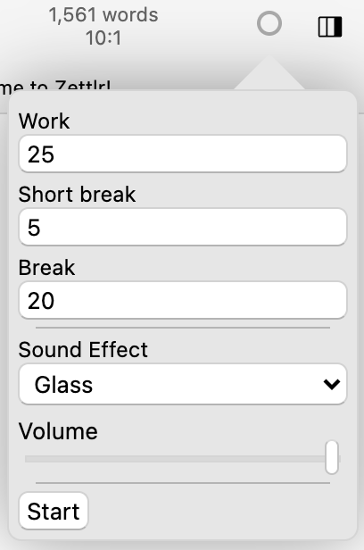
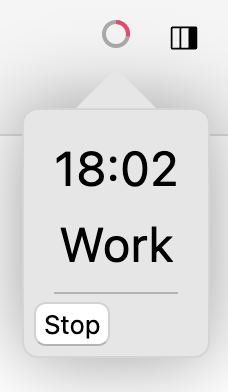

# Pomodoro Timer

If you write a lot, the time may come that you need to organise your time better. The built-in Pomodoro Timer can help you with this.

Access the Pomodoro Timer by clicking on the circle in the top right corner of the screen, inside the Toolbar.

Don't know what a pomodoro timer is? Then head over to [the official website](https://francescocirillo.com/pages/pomodoro-technique)!

## Using the Pomodoro timer

Before you start the Pomodoro Timer, you can adapt some settings.

The **red** number indicates the amount of minutes used to _work_. The default is 25 minutes.

The **yellow** number indicates the duration of a _short_ break that will divide portions of work. After each work-phase there will be a short break. The default is 5 minutes.

The **green** number tells Zettlr, how long a _long_ break should be. After every four tasks, there will be such a long break. The default duration is 20 minutes.

Below, you can decide whether or not a sound should be played each time a phase has ended. Adjust the volume with the slider (0% means the sound will be muted).

> This is not your system volume, so if your system's volume is only at 20 percent, even a volume of 100 percent inside Zettlr will only sound as loud as 20 percent.

Finally, you can also choose which sound Zettlr will play when a phase ends: The known, soft glass sound, an alarm clock, or a chime.

Click on **Start** to begin the timer. Then, the circle will be filled with the color of the current phase (either red, yellow, or green). Once it is full, the next phase will begin.

To **Stop** the timer or simply review the current **status** of the timer, click on the circle again. A small popup will tell you the remaining amount of time for the current phase, the type of the current phase and give you the option to stop.

The **cycle** of the pomodoro timer is as follows:

1. Work
2. Short break
3. Work
4. Short break
5. Work
6. Short break
7. Work
8. Long break
9. _Repeat from step 1_
